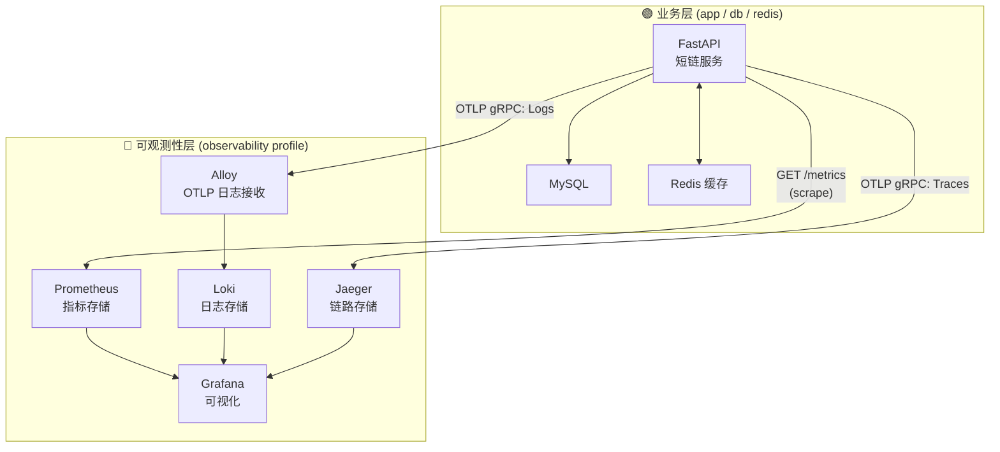

<p align="center">
  <h1 align="center"> DevOps Observability Workshop</h1>
  <p align="center">
    教学级 · 可复用 · 校招导向<br>
    <strong>从可观测性到 SLO 驱动的 CI/CD，一个项目讲透现代 DevOps 核心实践</strong>
  </p>
  <p align="center">
    
    
    
    
    
    
    
  </p>
</p>


---

## 📖 项目定位

一套**「可复用的方法论 + 动手实验」**，专门为准备**中厂 DevOps / SRE 校招**的同学设计的教学项目。

此项目重点关注 **全链路可观测性架构** ，采用了单节点、非集群的简化结构。（k8s集群、基础设施项目施工中，请关注后续项目）

通过一个极简的**短链服务**，你会亲手落地：

<table>
  <tr>
    <td align="center">📊 <strong>可观测性三大支柱</strong><br><small>Metrics / Logs / Tracing</small></td>
    <td align="center">🎯 <strong>SLO / 错误预算</strong><br><small>定义 → 告警 → 发布决策</small></td>
    <td align="center">🔗 <strong>三信号关联排查</strong><br><small>Grafana → Loki → Jaeger</small></td>
    <td align="center">🔄 <strong>CI/CD 质量门禁</strong><br><small>压测 → SLO 校验 → 阻断/放行</small></td>
  </tr>
</table>

---

## 🏗️ 架构总览

### 数据流图



### 核心设计要点

<table>
  <tr>
    <th width="140">维度</th>
    <th>实现</th>
  </tr>
  <tr>
    <td><strong>Metrics</strong></td>
    <td><code>prometheus-fastapi-instrumentator</code> 自动暴露 + 自定义带 <code>short_code</code> 标签的 Histogram/Counter 指标</td>
  </tr>
  <tr>
    <td><strong>Logs</strong></td>
    <td>结构化 JSON 日志，通过 <code>TraceIdFilter</code> 注入 trace_id，经 <strong>Alloy</strong> 转发至 Loki</td>
  </tr>
  <tr>
    <td><strong>Traces</strong></td>
    <td><code>FastAPIInstrumentor</code> / <code>SQLAlchemyInstrumentor</code> / <code>RedisInstrumentor</code> 自动埋点，直推 Jaeger</td>
  </tr>
  <tr>
    <td><strong>关联跳转</strong></td>
    <td>Loki → Jaeger（Derived Fields 一键跳转）、自定义指标 → Loki（Data Link）</td>
  </tr>
  <tr>
    <td><strong>降级保护</strong></td>
    <td>Redis 熔断器：3 次失败熔断 → 30s 半开探测 → 降级直连 DB，响应头标记 <code>X-Redis-Degraded</code></td>
  </tr>
  <tr>
    <td><strong>SLO 门禁</strong></td>
    <td>k6 压测 → 查 Prometheus burn rate → &gt;10 则阻止部署</td>
  </tr>
</table>

---

## 📡 服务列表

| 服务 | 地址 | 说明 | Profile |
|----------|-------|------|---------|
| **短链 API** | `http://localhost:8000` | FastAPI 业务服务 | `-` |
| **MySQL** | `localhost:3306` | 持久化存储 | `-` |
| **Redis** | `localhost:6379` | 缓存（TTL 300s） | `-` |
| **Prometheus** | `http://localhost:9090` | 指标采集 + 告警规则 | `observability` |
| **Grafana** | `http://localhost:3000` | 可视化面板（匿名登录） | `observability` |
| **Loki** | `http://localhost:3100` | 日志存储 | `observability` |
| **Alloy** | `localhost:4317` | OTLP 日志接收 → Loki | `observability` |
| **Jaeger** | `http://localhost:16686` | 分布式链路追踪 UI | `observability` |

---

## 🛠️ 技术栈

| 领域 | 工具 |
|-----------|-------|
| 业务后端 | Python 3.11 + FastAPI 0.115 |
| 数据存储 | MySQL 8.0 + Redis 7 |
| 可观测性 | OpenTelemetry + Prometheus + Grafana + Loki + Alloy + Jaeger |
| CI/CD | GitHub Actions + Docker + k6 |
| 部署 | Docker Compose（双网络隔离） |

---

## 🚀 快速开始

### 前置依赖

- Docker & Docker Compose
- Git

### 启动

```bash
# 克隆
git clone https://github.com/L7WD3-Xiao/devops-observability-workshop.git
cd devops-observability-workshop

# 启动全量服务（含可观测性）
make up-all

# 等待所有容器健康（约 30-60 秒）
make status
```

### 验证

```bash
# 1. 创建短链
curl -X POST "http://localhost:8000/shorten?original_url=https://www.baidu.com"
# → {"short_code":"AbCdEf"}

# 2. 跟随跳转
curl -v "http://localhost:8000/AbCdEf"
# → 302 → Location: https://www.baidu.com

# 3. 打开 Grafana
# http://localhost:3000（匿名登录）
```

---

## 📋 常用命令

| 命令 | 作用 |
|-------|---------|
| `make up` | 启动 app + MySQL + Redis |
| `make up-all` | 启动全部服务（含可观测性） |
| `make build` | 重新构建 app 镜像 |
| `make down` | 停止所有服务 |
| `make test` | 冒烟测试（创建 + 跳转验证） |
| `make test-e` | 错误路径测试（访问不存在短链） |
| `make test-sim` | 压测模拟（500 个请求 × 200ms 间隔） |
| `make check` | 查 Prometheus SLO 错误预算燃烧率 |
| `make logs-app` | 跟踪 app 日志 |
| `make logs-p` | 跟踪 Prometheus 日志 |
| `make logs-l` | 跟踪 Loki 日志 |
| `make logs-j` | 跟踪 Jaeger 日志 |
| `make logs-a` | 跟踪 Alloy 日志 |

---

## 📁 项目结构

```
shortener-observability/
├── app/                        # 短链服务源码（带可观测性埋点）
│   ├── main.py                 # FastAPI 路由、OTel 初始化、熔断器逻辑
│   ├── database.py             # SQLAlchemy 引擎 & 会话
│   ├── crud.py                 # 数据库 CRUD
│   ├── models.py               # URLMap ORM 模型
│   └── utils.py                # 短码生成、JSON 日志、CircuitBreakerState
├── prometheus/
│   ├── prometheus.yml           # 采集配置
│   └── rules.yml                # SLO recording rules + 告警规则
├── loki/                       # Loki 配置
├── alloy/                      # Alloy OTLP → Loki 管道配置
├── grafana/
│   └── provisioning/           # 数据源 & Dashboard 自动配置
├── .github/workflows/          # CI/CD 流水线
├── docs/                       # 方法论文档（含面试话术）
├── scripts/                    # 测试 & 压测脚本
├── .env
├── Dockerfile
├── docker-compose.yml
├── Makefile
└── requirements.txt
```

---

## 📚 文档索引

| 文档 | 内容 |
|------|---------|
| [阶段 1：短链服务](docs/01-shortener-app.md) | 业务代码、Dockerfile、docker-compose |
| [阶段 2：可观测性](docs/02-observability.md) | OTel 埋点、Prometheus、Loki、Alloy、Jaeger、关联跳转配置 |
| [阶段 3：SLO 与告警](docs/03-SLO-and-alert.md) | SLI/SLO 定义、错误预算燃烧率、PromQL 详解、告警规则、Grafana 看板 |
| [阶段 4：CI/CD](docs/04-cicd.md) | GitHub Actions 流水线设计、SSH 部署、SLO 门禁 |
| [阶段 5：高可用](docs/05-high-availability.md) | 熔断器、优雅降级、容灾演练、面试话术 |
| [路线图](docs/roadmap.md) | 从 0 到可观测性的完整落地路线 |
| [简历 & 面试](docs/resume-and-interview.md) | STAR 简历、面试问答 |

---

## 🧭 路线图

| 阶段 | 主题 | 产出 |
|-------|-------|--------|
| 0 | 脚手架 & 业务雏形 | 能跑的短链服务（HTTP + DB + Redis） |
| 1 | **可观测性骨架** | Metrics + Logs + Tracing 三大信号跑通 |
| 2 | **SLO & 告警** | 核心 SLO + 告警规则 |
| 3 | **CI/CD** | push 代码 → 自动构建 → 自动部署 |
| 4 | **高可用 & 容灾** | 消除单点 + 故障模拟 |

> 详细路线图见 [docs/roadmap.md](docs/roadmap.md)

---

## 📄 License

MIT

## 🙏 致谢

本项目受 [Google SRE Book](https://sre.google/books/) 及开源社区实践启发，所有配置均可直接复用于个人学习或团队内部分享。
