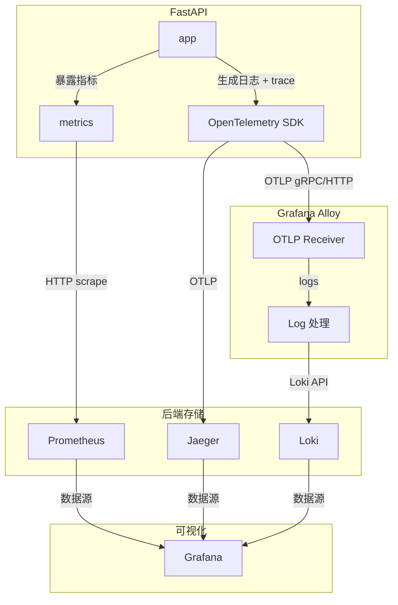

# 说明

业务代码分两阶段，仅业务（对应章节-短链项目）和包括指标埋点的（对应章节-可观测性），[业务代码改动详见此处](app_code.md)，本篇仅列出运维相关工作，不详细阐述。

# 一、短链项目

技术栈：`python` `fastapi`  `mysql`  `redis`  `docker` 

## 项目结构

最小项目结构（仅业务）

```text
shortener/
├── docker-compose.yml
├── requirements.txt
├── .env
├── app/
│   ├── main.py
│   ├── database.py
│   ├── models.py
│   ├── crud.py
│   └── utils.py
```

**请根据说明检查并调整对应的业务代码**

---

## Dockerfile

用于将业务代码构建为镜像

```dockerfile
FROM python:3.11-slim
WORKDIR /app
COPY requirements.txt .
ENV PIP_NO_CACHE_DIR=1 \
    PIP_DISABLE_PIP_VERSION_CHECK=1 \
    PIP_DEFAULT_TIMEOUT=100 \
    PIP_INDEX_URL=https://pypi.tuna.tsinghua.edu.cn/simple
RUN pip install --upgrade pip \
    && pip install --no-cache-dir -r requirements.txt
COPY ./app /app
EXPOSE 8000
CMD ["python", "-m", "uvicorn", "main:app", "--host", "0.0.0.0", "--port", "8000", "--reload"]
```

注：python项目不用设置两阶段构建，但注意合并多个`RUN`

## Docker-compose

docker-compose.yml

仅需启动app和依赖（mysql、redis）

```yml
services:
  app:
    build: .
    container_name: shortener-app
    ports:
      - "8000:8000"
    depends_on:
      db:
        condition: service_healthy
      redis:
        condition: service_healthy
    environment:
      DATABASE_URL: mysql+pymysql://root:123456@db:3306/shortener
      REDIS_URL: redis://redis:6379/0
    volumes:
      - ./app:/app
      
  db:
    image: mysql:8.0
    container_name: shortener-db
    command: --default-authentication-plugin=mysql_native_password
    environment:
      MYSQL_ROOT_PASSWORD: 123456
      MYSQL_DATABASE: shortener
    ports:
      - "3306:3306"
    healthcheck:
      test: ["CMD", "mysqladmin", "ping", "-h", "localhost"]
      timeout: 20s
      retries: 10
  
  redis:
    image: redis:7-alpine
    container_name: shortener-redis
    ports:
      - "6379:6379"
    healthcheck:
      test: ["CMD", "redis-cli", "ping"]
      timeout: 20s
      retries: 10
```

注：本项目为方便开箱即用，将数据库也放入容器，生产环境中除大厂数据库高可用场景外，一般将其直接部署于宿主机。

## 测试短链

```sh
# 0. 构建镜像
docker compose build
# 1. 启动所有服务
docker compose up -d

# 2. 创建短链
curl -X POST "http://localhost:8000/shorten?original_url=https://www.baidu.com"

# 返回: {"short_code":"aBc123","short_url":"http://localhost:8000/aBc123"}

# 3. 访问跳转（第一次 miss，客户端应看到返回的网页）
# 最后替换为实际得到的short_code
curl -L http://localhost:8000/[short_code]

# 查看容器日志，查看 miss 的 log
docker compose logs app

# 4. 第二次访问（命中缓存），通过容器日志查看
curl -L http://localhost:8000/[short_code]
docker compose logs app
```

备注：也可使用项目中 Makefile 的预制指令快速测试

```bash
make test
```

`docker compose logs app`后应该能看到日志内容

```sh
shortener-app  | INFO:     172.25.0.1:38972 - "POST /shorten?original_url=https://www.baidu.com HTTP/1.1" 200 OK
shortener-app  | INFO:main:cache miss
shortener-app  | INFO:     172.25.0.1:38656 - "GET /2T4vUl HTTP/1.1" 307 Temporary Redirect
shortener-app  | INFO:main:cache hit
shortener-app  | INFO:     172.25.0.1:38982 - "GET /2T4vUl HTTP/1.1" 307 Temporary Redirect
```

一处 `cache miss` 一处 `cache hit`

# 二、可观测性

技术栈：`Prometheus` `Grafana`  `Loki`  `OpenTelemetry`   `Tempo`

## 项目结构

最终项目结构

```text
shortener-observability/
├── .env
├── Makefile
├── docker-compose.yml
├── requirements.txt            # 需修改
├── alloy/
│   └── config.alloy
├── prometheus/
│   └── prometheus.yml
├── loki/
│   └── loki-config.yaml
├── grafana/
│   └── provisioning/           # Grafana自动配置
│       ├── datasources/        # 数据源（自动添加Prom/Loki/Tempo）
│       └── dashboards/         # 预置Dashboard
└── app/
    ├── Dockerfile
    ├── requirements.txt
    ├── main.py                 # 增强版（带OpenTelemetry）
    ├── database.py
    ├── models.py
    ├── crud.py
    └── utils.py
```

**请根据说明检查并调整对应的业务代码**

------

## 数据流图

从应用到监控面板的数据流图



## 服务总览

| 服务       | 地址                                            | 用途               |
| :--------- | :---------------------------------------------- | :----------------- |
| 短链API    | [http://localhost:8000](http://localhost:8000/) | 业务服务           |
| Prometheus | [http://localhost:9090](http://localhost:9090/) | Metrics采集        |
| Grafana    | [http://localhost:3000](http://localhost:3000/) | 可视化（匿名登录） |
| Loki       | [http://localhost:3100](http://localhost:3100/) | 日志存储           |
| Jaeger UI  | http://localhost:16686                          | 链路可视化         |

------


```
curl "http://localhost:3200/api/traces/7d65e90f42ad12a829863d16fb167219" | jq
```