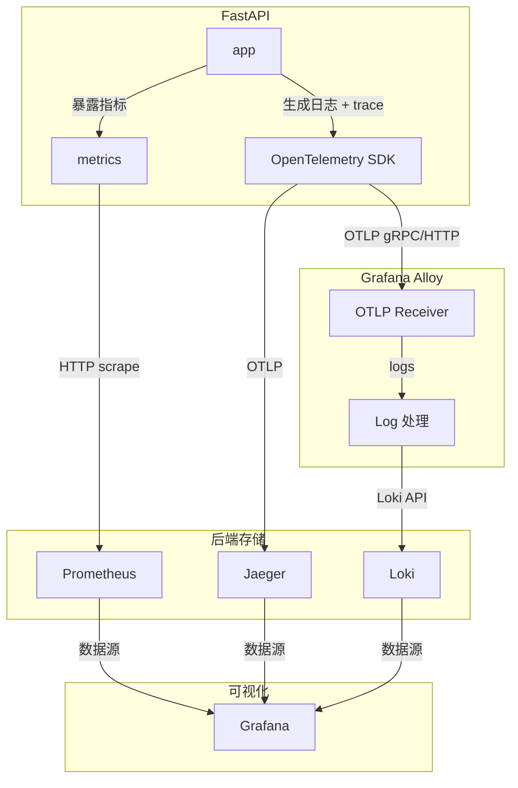

# 说明

业务代码分两阶段，仅业务的最小代码（对应章节-短链项目）和包括指标埋点的完整代码（对应章节-可观测性），[业务代码详见此处](app_code.md)，本篇仅列出运维相关工作，不详细阐述。

# 一、短链项目

技术栈：`python` `fastapi`  `mysql`  `redis`  `docker` 

## 项目结构

最小项目结构（仅业务）

```text
shortener/
├── docker-compose.yml
├── requirements.txt
├── .env
├── app/
│   ├── main.py
│   ├── database.py
│   ├── models.py
│   ├── crud.py
│   └── utils.py
```

**请根据说明检查并调整对应的业务代码**

---

## Dockerfile

用于将业务代码构建为镜像

```dockerfile
FROM python:3.11-slim
WORKDIR /app
COPY requirements.txt .
ENV PIP_NO_CACHE_DIR=1 \
    PIP_DISABLE_PIP_VERSION_CHECK=1 \
    PIP_DEFAULT_TIMEOUT=100 \
    PIP_INDEX_URL=https://pypi.tuna.tsinghua.edu.cn/simple
RUN pip install --upgrade pip \
    && pip install --no-cache-dir -r requirements.txt
COPY ./app /app
EXPOSE 8000
CMD ["python", "-m", "uvicorn", "main:app", "--host", "0.0.0.0", "--port", "8000", "--reload"]
```

注：python项目不用设置两阶段构建，但注意合并多个`RUN`

## Docker-compose

docker-compose.yml

核心服务

```yml
services:
  app:
    build: .
    container_name: shortener-app
    ports:
      - "8000:8000"
    depends_on:
      db:
        condition: service_healthy
      redis:
        condition: service_healthy
    environment:
      DATABASE_URL: mysql+pymysql://root:123456@db:3306/shortener
      REDIS_URL: redis://redis:6379/0
    volumes:
      - ./app:/app
      
  db:
    image: mysql:8.0
    container_name: shortener-db
    command: --default-authentication-plugin=mysql_native_password
    environment:
      MYSQL_ROOT_PASSWORD: 123456
      MYSQL_DATABASE: shortener
    ports:
      - "3306:3306"
    healthcheck:
      test: ["CMD", "mysqladmin", "ping", "-h", "localhost"]
      timeout: 20s
      retries: 10
  
  redis:
    image: redis:7-alpine
    container_name: shortener-redis
    ports:
      - "6379:6379"
    healthcheck:
      test: ["CMD", "redis-cli", "ping"]
      timeout: 20s
      retries: 10
```

注：本项目为方便开箱即用，将数据库也放入容器，生产环境中除大厂数据库高可用场景外，一般将其直接部署于宿主机。

## 测试短链

```sh
# 0. 构建镜像
docker compose build
# 1. 启动所有服务
docker compose up -d

# 2. 创建短链
curl -X POST "http://localhost:8000/shorten?original_url=https://www.baidu.com"

# 返回: {"short_code":"aBc123","short_url":"http://localhost:8000/aBc123"}

# 3. 访问跳转（第一次 miss，客户端应看到返回的网页）
# 最后替换为实际得到的short_code
curl -L http://localhost:8000/[short_code]

# 查看容器日志，查看 miss 的 log
docker compose logs app

# 4. 第二次访问（命中缓存），通过容器日志查看
curl -L http://localhost:8000/[short_code]
docker compose logs app
```

备注：也可使用项目中 Makefile 的预制指令快速测试

```bash
make test
```

`docker compose logs app`后应该能看到日志内容

```sh
shortener-app  | INFO:     172.25.0.1:38972 - "POST /shorten?original_url=https://www.baidu.com HTTP/1.1" 200 OK
shortener-app  | INFO:main:cache miss
shortener-app  | INFO:     172.25.0.1:38656 - "GET /2T4vUl HTTP/1.1" 307 Temporary Redirect
shortener-app  | INFO:main:cache hit
shortener-app  | INFO:     172.25.0.1:38982 - "GET /2T4vUl HTTP/1.1" 307 Temporary Redirect
```

一处 `cache miss` 一处 `cache hit`

# 二、可观测性

技术栈：`Prometheus` `Grafana`  `Loki`  `OpenTelemetry`   `Tempo`

## 项目结构

最终项目结构

```text
shortener-observability/
├── .env
├── Makefile
├── docker-compose.yml
├── requirements.txt            # 需修改
├── alloy/
│   └── config.alloy
├── prometheus/
│   ├── prometheus.yml
│   └── rules.yml
├── loki/
│   └── loki-config.yaml
├── grafana/
│   └── provisioning/           # Grafana自动配置
│       ├── datasources/        # 数据源（自动添加Prom/Loki/Tempo）
│       └── dashboards/         # 预置Dashboard
└── app/
    ├── Dockerfile
    ├── requirements.txt
    ├── main.py                 # 增强版（带OpenTelemetry）
    ├── database.py
    ├── models.py
    ├── crud.py
    └── utils.py
```

**请根据说明检查并调整对应的业务代码**

------

## 数据流图

从应用到监控面板的数据流图



## 服务总览

| 服务       | 地址                                            | 用途               |
| :--------- | :---------------------------------------------- | :----------------- |
| 短链API    | [http://localhost:8000](http://localhost:8000/) | 业务服务           |
| Prometheus | [http://localhost:9090](http://localhost:9090/) | Metrics采集        |
| Grafana    | [http://localhost:3000](http://localhost:3000/) | 可视化（匿名登录） |
| Loki       | [http://localhost:3100](http://localhost:3100/) | 日志存储           |
| Jaeger UI  | http://localhost:16686                          | 链路可视化         |

------

## Docker-compose

docker-compose.yml

```yml
services:
  # 核心服务（略）
  
  # 可观测性
  alloy:
    image: grafana/alloy:latest
    container_name: observability-alloy
    profiles: ["observability"]
    volumes:
      - ./alloy/config.alloy:/etc/alloy/config.alloy
    command: ["run", "--server.http.listen-addr=0.0.0.0:12345", "/etc/alloy/config.alloy"]
    ports:
      - "4317:4317"   # OTLP gRPC
      - "4318:4318"   # OTLP HTTP
    networks:
      - observability

  prometheus:
    image: prom/prometheus:latest
    container_name: observability-prometheus
    profiles: ["observability"]
    volumes:
      - ./prometheus/prometheus.yml:/etc/prometheus/prometheus.yml
      - ./prometheus/rules.yml:/etc/prometheus/rules.yml
      - prometheus_data:/prometheus
    ports:
      - "9090:9090"
    command:
      - '--config.file=/etc/prometheus/prometheus.yml'
      - '--storage.tsdb.path=/prometheus'
      - '--storage.tsdb.retention.time=15d'
    deploy:
      resources:
        limits:
          memory: 256M
    restart: unless-stopped
    networks:
      - observability

  jaeger:
    image: jaegertracing/all-in-one:1.57
    container_name: observability-jaeger
    profiles: ["observability"]
    # command: ["--collector.otlp.enabled=true", "--collector.otlp.grpc.host-port=:4317", "--collector.otlp.http.host-port=:4318"]
    environment:
      - COLLECTOR_OTLP_ENABLED=true
      - COLLECTOR_OTLP_GRPC_HOST_PORT=:4317
      - COLLECTOR_OTLP_HTTP_HOST_PORT=:4318
    ports:
      - "16686:16686"   # Jaeger UI
    networks:
      - observability

  loki:
    image: grafana/loki:2.9.0
    container_name: observability-loki
    profiles: ["observability"]
    volumes:
      - ./loki/loki-config.yaml:/etc/loki/local-config.yaml
      - loki_data:/loki
    command: -config.file=/etc/loki/local-config.yaml
    ports:
      - "3100:3100"
    deploy:
      resources:
        limits:
          memory: 256M
    restart: unless-stopped
    networks:
      - observability

  grafana:
    image: grafana/grafana:latest
    container_name: observability-grafana
    profiles: ["observability"]
    volumes:
      - ./grafana/provisioning:/etc/grafana/provisioning
      - grafana_data:/var/lib/grafana
    ports:
      - "3000:3000"
    environment:
      GF_AUTH_ANONYMOUS_ENABLED: "true"
      GF_AUTH_ANONYMOUS_ORG_ROLE: "Admin"
    deploy:
      resources:
        limits:
          memory: 128M
    restart: unless-stopped
    networks:
      - observability


networks:
  app-network:
    driver: bridge
  observability:
    driver: bridge
    attachable: true

volumes:
  db_data:
  redis_data:
  prometheus_data:
  tempo_data:
  loki_data:
  grafana_data:
```

## 可观测性测试

### 0.准备工作

查看容器状态

```bash
make status
```

所有容器应正常（显示Up而非Restart等）

```text
STATUS
Up 5 days
```

访问Grafana：http://localhost:3000

进入Explore，查看可观测性三大支柱

### 1.指标-Metrics

选择 Prometheus，查询 `http_requests_total{}`


### 2.日志-Logs

切换到 Loki，搜索 `{job="shortener-service"}`


### 3.链路-Traces

从日志中复制一个 `trace_id`，粘贴到 Tempo 数据源


# 三、SLO与告警

## 预备知识

### 1.名词解释

#### SLI（服务质量指标）

- **可用性**：请求成功返回 HTTP 2xx/3xx 的比例（排除404等业务错误）
- **延迟**：请求在 **100ms** 内完成的 proportion

#### SLO 目标

SLO：服务等级目标，**对 SLI 设定的目标值或范围**，代表服务承诺应达到的健康水平。

- **P99可用性**：99% 的请求成功返回 HTTP 2xx/3xx，对应下方的1% 的请求的错误预算
- **P99延迟**：99% 的跳转请求在 200ms 内成功返回

#### 错误预算-Error Budget

- 1% 的请求可以超过 100ms 或失败（每10000个请求允许100个“坏请求”）

### 2.常见监控指标

通常分为 **四个黄金指标（Google SRE 经典）** + 扩展指标：

| 类别         | 指标（SLI 候选）                                             | 典型阈值（举例）                   |
| :----------- | :----------------------------------------------------------- | :--------------------------------- |
| **延迟**     | 平均延迟、P50/P90/P99/P999 延迟（秒或毫秒）                  | P99 < 200ms                        |
| **流量**     | QPS / TPS、并发连接数、请求速率变化                          | 正常波动 < 30%                     |
| **错误**     | HTTP 5xx 率、超时率、业务错误码率                            | 错误率 < 0.1%                      |
| **饱和度**   | CPU/内存/磁盘使用率、goroutine/线程数、队列长度              | CPU < 80%                          |
| **可用性**   | 服务可请求成功的比例                                         | 99.9% ~ 99.999%                    |
| **其他关键** | - 数据库慢查询数 - 缓存命中率 - 消息队列积压 - DNS解析成功率 - SSL证书过期时间 | 慢查 < 1% 命中率 > 95% 积压 < 1000 |

**一句话原则**：监控 **用户能感知到的事情**（慢、失败、不可用），而不是内部无意义的“黑盒指标”。

### 3.统计时间尺度

| 用途                       | 粒度     | 窗口                     | 使用场景                       |
| :------------------------- | :------- | :----------------------- | :----------------------------- |
| **实时告警**               | 1s ~ 10s | 最近 1~5 分钟            | 快速发现异常（比如错误率突增） |
| **短期分析（SLO 燃烧率）** | 1 分钟   | 1 小时 / 5 分钟          | 检测 SLO 消耗过快，提前干预    |
| **标准 SLO 计算窗口**      | 1 分钟   | **滚动 30 天**（最常见） | 计算当前可用性、错误预算剩余   |
| **月报 / 趋势**            | 1 小时   | 3~12 个月                | 容量规划、供应商评估           |

> **重点**：SLO 通常采用 **滚动时间窗口**（如过去 28 天 / 30 天），而不是自然月，避免月初重置预算。

**举例**：

- 告警窗口：过去 5 分钟错误率 > 1% → 触发预警
- SLO 窗口：过去 30 天内总请求 1 亿次，错误次数 8 万 → 错误率 = 0.08% → 对比 SLO(0.1%) → 剩余预算充足

## 本项目监控大盘

一图流：


左半边为可用性监控，右半边为延迟监控，下面我们分别来看。

### 可用性

> 先明确基础数据来源：  
> 我们的 FastAPI 服务通过 `prometheus-fastapi-instrumentator` 自动暴露了以下指标（命名可能略有不同，但逻辑一致）：
>
> - `http_requests_total`：请求总数（labels: method, path, status_code）
> - `http_request_duration_seconds_bucket`：请求延迟直方图桶（labels: method, path, le）

（该部分仅介绍部分时间尺度的SLO，其余时间尺度写法相似，不重复介绍）

---

#### 1.`redirect_total`

```yaml
- record: shortener:redirect_total
  expr: |
    sum(
      increase(http_requests_total{method="GET", handler="/{short_code}"}[1h])
    )
```

**含义**：短链跳转接口（`GET /{code}`）的总请求次数，按 `code` 和 `cache_hit` 标签分组。

**拆解**：

- `fastapi_requests_total{method="GET", path=~"/[a-zA-Z0-9]+"}`：筛选出所有 HTTP GET 请求，且路径是 `/` 后跟一串字母数字（即短链 code）。正则 `/[a-zA-Z0-9]+` 排除了 `/shorten` 等路径。
- `increase(...[1h])`：计算每个指标在过去 1 小时内的增量（即新增请求数）。

> 这条 rule 是为了后续计算错误率时，只统计跳转接口，避免混入 `/shorten` 等写操作。

---

#### 2. `redirect_success_total`

```yaml
- record: shortener:redirect_success_total
  expr: |
    sum(
      increase(http_requests_total{method="GET", handler="/{short_code}", status=~"2xx|3xx"}[1h])
    )
```

**含义**：成功的目标请求总数，满足 **状态码成功（2xx或3xx）**。

**拆解**：

- `increase(http_requests_total{..., status=~"2xx|3xx"}[1h])`  
  状态码为 2xx 或 3xx 的请求增量（3xx 是因为跳转是 302/301）。

#### 3.`sli_current`

```yaml
- record: shortener:sli_current
  expr: shortener:redirect_success_total / shortener:redirect_total
```

**含义**：当前 SLI（实际成功率）。

**拆解**：

- SLI = `成功的目标请求总数 / 总的目标请求总数`

---

#### 4. `error_budget_burn_rate`

```yaml
- record: shortener:error_budget_burn_rate
  expr: |
     (1 - shortener:sli_current)
     /
     (1 - max(slo:target))
```

**含义**：错误预算燃烧率。 
**公式**：`实际错误率 / (1 - SLO目标)` 

**拆解**：

- `1 - shortener:sli_current`：实际错误率
- `1 - max(slo:target)`：错误预算（设定的目标错误率上限，如P99则对应1%）
  - 关于`max(slo:target)`，本项目中将`slo:target`也设为record，有时该指标不能实时更新（虽然该数值不变，但不是每个统计时间点都传输值），为防止错误，用`max()`滤一下。

```yml
- record: slo:target
  expr: 0.9
  labels:
    service: "my-service"
    tier: "production"
```

#### 5. `error_budget_remaining`

```yaml
- record: shortener:error_budget_remaining_week
  expr: |
    1 - (
       (1 - shortener:sli_week)
       /
       (1 - max(slo:target))
    )
```

**含义**：过去 1 周内，剩余的错误预算比例。（时间尺度可调整）
**公式**：`1 - (实际错误率 / (1 - SLO目标))` = 剩余预算比例。

**拆解**：

- 其实实际就等于`1 - 错误预算燃烧率`，只是本项目的`error_budget_remaining`用来统计长时间尺度（如生产环境中的月度KPI），错误预算燃烧率统计短时间尺度（用于告警）。

---

### 延迟

#### P99

```yaml
- record: shortener:redirect_p99_latency_seconds
  expr: histogram_quantile(0.99, sum(rate(http_request_duration_seconds_bucket{method="GET", handler="/{short_code}"}[5m])) by (le))
```

**含义**：短链跳转接口（`GET /{code}`）的总请求次数，按 `code` 和 `cache_hit` 标签分组。

**拆解**：

- `histogram_quantile(φ, b)`用于从直方图（histogram）中计算指定的分位数（quantile）。φ为一个介于 0 和 1 之间的小数，表示所需的分位数。例如，*φ=0.95* 表示 P95。b为一个包含直方图数据的即时向量（instant vector），由 Prometheus 的 `_bucket` 时间序列提供。
- `sum(rate(http_request_duration_seconds_bucket{...}[5m])) by (le)` 
  按`le`分组聚合。这里 `le` 是直方图的一个桶。

---

## 告警规则详解

### 1. `ErrorBudgetBurnRateHigh`

```yaml
- alert: ErrorBudgetBurnRateHigh
  expr:  shortener:error_budget_burn_rate > 10
  for: 5m
```

**含义**：过去1小时内，实际的错误比例超过了错误预算的 10 倍。（如P99目标，允许的错误为1%，实际错误率为10%）
注意，此处的时间尺度为1h，短期的错误率很高，说明预算正在被极速烧光。

**为什么设置 `for: 5m`**：避免瞬时的尖刺误报，持续 5 分钟才触发。

#### 直观理解

- **Burn Rate = 1**
  → 按当前速率消耗预算，刚好在窗口结束时用光预算（维持 SLO 边界）
- **Burn Rate = 0.5**
  → 消耗速度只有允许速度的一半 → 很健康
- **Burn Rate = 10**
  → 每小时消耗 10 小时的预算额度 → 几小时内就会烧光预算

### 2. `ErrorBudgetLow`

```yaml
- alert: ErrorBudgetLow
  expr: shortener:error_budget_remaining < 0.3
  for: 5m
```

**含义**：剩余错误预算低于 30%。也就是说，实际表现已经接近 SLO 边缘。例如预算总额是 1% 的请求可失败，当已消耗 0.7% 时，只剩 0.3% 的额度，触发告警。

### 3. `HighLatencySLO`

```yaml
- alert: HighLatencySLO
  expr: shortener:redirect_p99_latency_seconds > 0.2
  for: 2m
```

**含义**：P99延迟超过200ms，且持续超过2m。

---

## 待完成

高延迟短链Top N

AlertManager

# 四、CI/CD

项目结构

```text
shortener/
├── .github/
│   └── workflows/
│       ├── ci.yml          ← 持续集成流程（如运行测试）
│       ├── deploy.yml      ← 部署流程
│       └── scheduled.yml   ← 定时任务
├── (其他内容)
├── .gitignore
└── README.md
```

