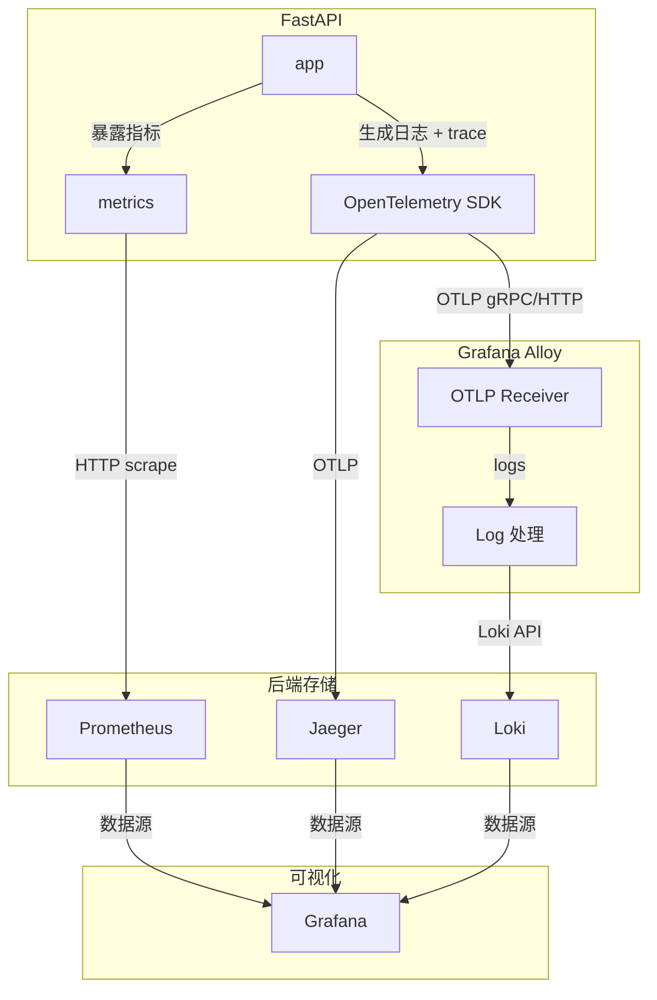

# 二、可观测性

技术栈：`Prometheus` `Grafana`  `Loki`  `OpenTelemetry`   `Alloy` `Jaeger`

## 1.项目结构

最终项目结构

```text
shortener-observability/
├── .env
├── Makefile
├── docker-compose.yml
├── requirements.txt            # 需修改
├── alloy/
│   └── config.alloy
├── prometheus/
│   ├── prometheus.yml
│   └── rules.yml
├── loki/
│   └── loki-config.yaml
├── grafana/
│   └── provisioning/           # Grafana自动配置
│       ├── datasources/        # 数据源（自动添加Prom/Loki/Tempo）
│       └── dashboards/         # 预置Dashboard
└── app/
    ├── Dockerfile
    ├── requirements.txt
    ├── main.py                 # 增强版（带OpenTelemetry）
    ├── database.py
    ├── models.py
    ├── crud.py
    └── utils.py
```

**请根据说明检查并调整对应的业务代码**

------

## 2.数据流图

本项目采用埋点式的代码侵入方案。

从应用到监控面板的数据流图



## 3.服务总览

| 服务       | 地址                                            | 用途               |
| :--------- | :---------------------------------------------- | :----------------- |
| 短链API    | [http://localhost:8000](http://localhost:8000/) | 业务服务           |
| Prometheus | [http://localhost:9090](http://localhost:9090/) | Metrics采集        |
| Grafana    | [http://localhost:3000](http://localhost:3000/) | 可视化（匿名登录） |
| Loki       | [http://localhost:3100](http://localhost:3100/) | 日志存储           |
| Jaeger UI  | http://localhost:16686                          | 链路可视化         |

------

## 4.配置要点

#### Docker-compose

docker-compose.yml

```yml
services:
  # 核心服务（略）
  
  # 可观测性
  alloy:
    image: grafana/alloy:latest
    container_name: observability-alloy
    profiles: ["observability"]
    volumes:
      - ./alloy/config.alloy:/etc/alloy/config.alloy
    command: ["run", "--server.http.listen-addr=0.0.0.0:12345", "/etc/alloy/config.alloy"]
    ports:
      - "4317:4317"   # OTLP gRPC
      - "4318:4318"   # OTLP HTTP
    networks:
      - observability

  prometheus:
    image: prom/prometheus:latest
    container_name: observability-prometheus
    profiles: ["observability"]
    volumes:
      - ./prometheus/prometheus.yml:/etc/prometheus/prometheus.yml
      - ./prometheus/rules.yml:/etc/prometheus/rules.yml
      - prometheus_data:/prometheus
    ports:
      - "9090:9090"
    command:
      - '--config.file=/etc/prometheus/prometheus.yml'
      - '--storage.tsdb.path=/prometheus'
      - '--storage.tsdb.retention.time=15d'
    deploy:
      resources:
        limits:
          memory: 256M
    restart: unless-stopped
    networks:
      - observability

  jaeger:
    image: jaegertracing/all-in-one:1.57
    container_name: observability-jaeger
    profiles: ["observability"]
    # command: ["--collector.otlp.enabled=true", "--collector.otlp.grpc.host-port=:4317", "--collector.otlp.http.host-port=:4318"]
    environment:
      - COLLECTOR_OTLP_ENABLED=true
      - COLLECTOR_OTLP_GRPC_HOST_PORT=:4317
      - COLLECTOR_OTLP_HTTP_HOST_PORT=:4318
    ports:
      - "16686:16686"   # Jaeger UI
    networks:
      - observability

  loki:
    image: grafana/loki:2.9.0
    container_name: observability-loki
    profiles: ["observability"]
    volumes:
      - ./loki/loki-config.yaml:/etc/loki/local-config.yaml
      - loki_data:/loki
    command: -config.file=/etc/loki/local-config.yaml
    ports:
      - "3100:3100"
    deploy:
      resources:
        limits:
          memory: 256M
    restart: unless-stopped
    networks:
      - observability

  grafana:
    image: grafana/grafana:latest
    container_name: observability-grafana
    profiles: ["observability"]
    volumes:
      - ./grafana/provisioning:/etc/grafana/provisioning
      - grafana_data:/var/lib/grafana
    ports:
      - "3000:3000"
    environment:
      GF_AUTH_ANONYMOUS_ENABLED: "true"
      GF_AUTH_ANONYMOUS_ORG_ROLE: "Admin"
    deploy:
      resources:
        limits:
          memory: 128M
    restart: unless-stopped
    networks:
      - observability


networks:
  app-network:
    driver: bridge
  observability:
    driver: bridge
    attachable: true

volumes:
  db_data:
  redis_data:
  prometheus_data:
  tempo_data:
  loki_data:
  grafana_data:
```

### Grafana数据源

配置`.\grafana\provisioning\datasources\datasources.yaml`

```yaml
apiVersion: 1

datasources:
  - name: Prometheus
    type: prometheus
    access: proxy
    url: http://prometheus:9090
    isDefault: true
  
  - name: Jaeger
    type: jaeger
    access: proxy
    version: 1
    editable: false
    
  - name: Loki
    type: loki
    access: proxy
    url: http://loki:3100
    version: 1
    editable: false
```

## 5.可观测性测试

### 5.0.准备工作

查看容器状态

```bash
make status
```

所有容器应正常（显示Up而非Restart等）

```text
STATUS
Up 5 days
```

访问Grafana：http://localhost:3000

进入Explore，查看可观测性三大支柱

### 5.1.指标-Metrics

选择 Prometheus，查询 `http_requests_total{}`


### 5.2.日志-Logs

切换到 Loki，搜索 `{job="shortener-service"}`


### 5.3.链路-Traces

从日志中复制一个 `trace_id`，粘贴到 Jaeger 数据源


## 6.关联跳转（Trace / Logs）

在上面的测试中，我们是从日志中复制一个 `trace_id`，粘贴到 Jaeger 数据源。

那么，既然日志中有 `trace_id`，能不能直接将`trace_id`做成**快速跳转链接**，点一下直接跳转到  Jaeger 数据源？

如下方示例，TraceID 后有蓝色 Jaeger 图标


下面我们来配置

重新配置`.\grafana\provisioning\datasources\datasources.yaml`，主要更改 Jaeger 和 Loki 部分

```yaml
apiVersion: 1

datasources:
  - name: Prometheus
    type: prometheus
    access: proxy
    url: http://prometheus:9090
    isDefault: true
  
  - name: Jaeger
    type: jaeger
    access: proxy
    url: http://jaeger:16686
    uid: jaeger-uid   # 固定 UID，供 Loki derived field 引用
    jsonData:
      nodeGraph:
        enabled: true
      tracesToLogs:
        datasourceUid: loki-uid   # 反向关联：从 trace 跳到日志（可选）
        tags: ['traceid', 'spanid']
    version: 1
    editable: false
    
  - name: Loki
    type: loki
    access: proxy
    url: http://loki:3100
    uid: loki-uid    # 固定 UID，方便 jaeger 引用
    jsonData:
      derivedFields:
        - name: TraceID
          matcherRegex: '"traceid":"([a-f0-9]+)"'   # 匹配 JSON 日志中的 traceid 值
          url: '$${__value.raw}'                    # 注意要表示 "S" 需要用 $$ 转义
          datasourceUid: jaeger-uid
          internalLink: true
    version: 1
    editable: false
```

重启服务，在Grafana看板中，也可以看到对应的配置

进入Grafana -> Configuration -> Data sources -> Loki -> Derived fields


不过由于本项目的 Grafana 采用**预配置数据源**的形式，Grafana 中的更改并不会保存（指没给你保存按键），此处仅作演示。


