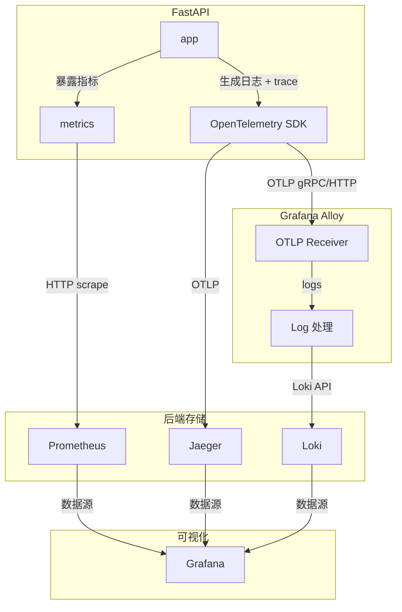

# 说明

业务代码分两阶段，仅业务的最小代码（对应章节-短链项目）和包括指标埋点的完整代码（对应章节-可观测性），[业务代码详见此处](app_code.md)，本篇仅列出运维相关工作，不详细阐述。

# 一、短链项目

技术栈：`python` `fastapi`  `mysql`  `redis`  `docker` 

## 1.项目结构

最小项目结构（仅业务）

```text
shortener/
├── docker-compose.yml
├── requirements.txt
├── .env
├── app/
│   ├── main.py
│   ├── database.py
│   ├── models.py
│   ├── crud.py
│   └── utils.py
```

**请根据说明检查并调整对应的业务代码**

---

## 2.Dockerfile

用于将业务代码构建为镜像

```dockerfile
FROM python:3.11-slim
WORKDIR /app
COPY requirements.txt .
ENV PIP_NO_CACHE_DIR=1 \
    PIP_DISABLE_PIP_VERSION_CHECK=1 \
    PIP_DEFAULT_TIMEOUT=100 \
    PIP_INDEX_URL=https://pypi.tuna.tsinghua.edu.cn/simple
RUN pip install --upgrade pip \
    && pip install --no-cache-dir -r requirements.txt
COPY ./app /app
EXPOSE 8000
CMD ["python", "-m", "uvicorn", "main:app", "--host", "0.0.0.0", "--port", "8000", "--reload"]
```

注：python项目不用设置两阶段构建，但注意合并多个`RUN`

## 3.Docker-compose

docker-compose.yml

核心服务

```yml
services:
  app:
    build: .
    container_name: shortener-app
    ports:
      - "8000:8000"
    depends_on:
      db:
        condition: service_healthy
      redis:
        condition: service_healthy
    environment:
      DATABASE_URL: mysql+pymysql://root:123456@db:3306/shortener
      REDIS_URL: redis://redis:6379/0
    volumes:
      - ./app:/app
      
  db:
    image: mysql:8.0
    container_name: shortener-db
    command: --default-authentication-plugin=mysql_native_password
    environment:
      MYSQL_ROOT_PASSWORD: 123456
      MYSQL_DATABASE: shortener
    ports:
      - "3306:3306"
    healthcheck:
      test: ["CMD", "mysqladmin", "ping", "-h", "localhost"]
      timeout: 20s
      retries: 10
  
  redis:
    image: redis:7-alpine
    container_name: shortener-redis
    ports:
      - "6379:6379"
    healthcheck:
      test: ["CMD", "redis-cli", "ping"]
      timeout: 20s
      retries: 10
```

注：本项目为方便开箱即用，将数据库也放入容器，生产环境中除大厂数据库高可用场景外，一般将其直接部署于宿主机。

## 4.测试短链

```sh
# 0. 构建镜像
docker compose build
# 1. 启动所有服务
docker compose up -d

# 2. 创建短链
curl -X POST "http://localhost:8000/shorten?original_url=https://www.baidu.com"

# 返回: {"short_code":"aBc123","short_url":"http://localhost:8000/aBc123"}

# 3. 访问跳转（第一次 miss，客户端应看到返回的网页）
# 最后替换为实际得到的short_code
curl -L http://localhost:8000/[short_code]

# 查看容器日志，查看 miss 的 log
docker compose logs app

# 4. 第二次访问（命中缓存），通过容器日志查看
curl -L http://localhost:8000/[short_code]
docker compose logs app
```

备注：也可使用项目中 Makefile 的预制指令快速测试

```bash
make test
```

`docker compose logs app`后应该能看到日志内容

```sh
shortener-app  | INFO:     172.25.0.1:38972 - "POST /shorten?original_url=https://www.baidu.com HTTP/1.1" 200 OK
shortener-app  | INFO:main:cache miss
shortener-app  | INFO:     172.25.0.1:38656 - "GET /2T4vUl HTTP/1.1" 307 Temporary Redirect
shortener-app  | INFO:main:cache hit
shortener-app  | INFO:     172.25.0.1:38982 - "GET /2T4vUl HTTP/1.1" 307 Temporary Redirect
```

一处 `cache miss` 一处 `cache hit`

# 二、可观测性

技术栈：`Prometheus` `Grafana`  `Loki`  `OpenTelemetry`   `Alloy` `Jaeger`

## 1.项目结构

最终项目结构

```text
shortener-observability/
├── .env
├── Makefile
├── docker-compose.yml
├── requirements.txt            # 需修改
├── alloy/
│   └── config.alloy
├── prometheus/
│   ├── prometheus.yml
│   └── rules.yml
├── loki/
│   └── loki-config.yaml
├── grafana/
│   └── provisioning/           # Grafana自动配置
│       ├── datasources/        # 数据源（自动添加Prom/Loki/Tempo）
│       └── dashboards/         # 预置Dashboard
└── app/
    ├── Dockerfile
    ├── requirements.txt
    ├── main.py                 # 增强版（带OpenTelemetry）
    ├── database.py
    ├── models.py
    ├── crud.py
    └── utils.py
```

**请根据说明检查并调整对应的业务代码**

------

## 2.数据流图

本项目采用埋点式的代码侵入方案。

从应用到监控面板的数据流图



## 3.服务总览

| 服务       | 地址                                            | 用途               |
| :--------- | :---------------------------------------------- | :----------------- |
| 短链API    | [http://localhost:8000](http://localhost:8000/) | 业务服务           |
| Prometheus | [http://localhost:9090](http://localhost:9090/) | Metrics采集        |
| Grafana    | [http://localhost:3000](http://localhost:3000/) | 可视化（匿名登录） |
| Loki       | [http://localhost:3100](http://localhost:3100/) | 日志存储           |
| Jaeger UI  | http://localhost:16686                          | 链路可视化         |

------

## 4.配置要点

#### Docker-compose

docker-compose.yml

```yml
services:
  # 核心服务（略）
  
  # 可观测性
  alloy:
    image: grafana/alloy:latest
    container_name: observability-alloy
    profiles: ["observability"]
    volumes:
      - ./alloy/config.alloy:/etc/alloy/config.alloy
    command: ["run", "--server.http.listen-addr=0.0.0.0:12345", "/etc/alloy/config.alloy"]
    ports:
      - "4317:4317"   # OTLP gRPC
      - "4318:4318"   # OTLP HTTP
    networks:
      - observability

  prometheus:
    image: prom/prometheus:latest
    container_name: observability-prometheus
    profiles: ["observability"]
    volumes:
      - ./prometheus/prometheus.yml:/etc/prometheus/prometheus.yml
      - ./prometheus/rules.yml:/etc/prometheus/rules.yml
      - prometheus_data:/prometheus
    ports:
      - "9090:9090"
    command:
      - '--config.file=/etc/prometheus/prometheus.yml'
      - '--storage.tsdb.path=/prometheus'
      - '--storage.tsdb.retention.time=15d'
    deploy:
      resources:
        limits:
          memory: 256M
    restart: unless-stopped
    networks:
      - observability

  jaeger:
    image: jaegertracing/all-in-one:1.57
    container_name: observability-jaeger
    profiles: ["observability"]
    # command: ["--collector.otlp.enabled=true", "--collector.otlp.grpc.host-port=:4317", "--collector.otlp.http.host-port=:4318"]
    environment:
      - COLLECTOR_OTLP_ENABLED=true
      - COLLECTOR_OTLP_GRPC_HOST_PORT=:4317
      - COLLECTOR_OTLP_HTTP_HOST_PORT=:4318
    ports:
      - "16686:16686"   # Jaeger UI
    networks:
      - observability

  loki:
    image: grafana/loki:2.9.0
    container_name: observability-loki
    profiles: ["observability"]
    volumes:
      - ./loki/loki-config.yaml:/etc/loki/local-config.yaml
      - loki_data:/loki
    command: -config.file=/etc/loki/local-config.yaml
    ports:
      - "3100:3100"
    deploy:
      resources:
        limits:
          memory: 256M
    restart: unless-stopped
    networks:
      - observability

  grafana:
    image: grafana/grafana:latest
    container_name: observability-grafana
    profiles: ["observability"]
    volumes:
      - ./grafana/provisioning:/etc/grafana/provisioning
      - grafana_data:/var/lib/grafana
    ports:
      - "3000:3000"
    environment:
      GF_AUTH_ANONYMOUS_ENABLED: "true"
      GF_AUTH_ANONYMOUS_ORG_ROLE: "Admin"
    deploy:
      resources:
        limits:
          memory: 128M
    restart: unless-stopped
    networks:
      - observability


networks:
  app-network:
    driver: bridge
  observability:
    driver: bridge
    attachable: true

volumes:
  db_data:
  redis_data:
  prometheus_data:
  tempo_data:
  loki_data:
  grafana_data:
```

### Grafana数据源

配置`.\grafana\provisioning\datasources\datasources.yaml`

```yaml
apiVersion: 1

datasources:
  - name: Prometheus
    type: prometheus
    access: proxy
    url: http://prometheus:9090
    isDefault: true
  
  - name: Jaeger
    type: jaeger
    access: proxy
    version: 1
    editable: false
    
  - name: Loki
    type: loki
    access: proxy
    url: http://loki:3100
    version: 1
    editable: false
```

## 5.可观测性测试

### 5.0.准备工作

查看容器状态

```bash
make status
```

所有容器应正常（显示Up而非Restart等）

```text
STATUS
Up 5 days
```

访问Grafana：http://localhost:3000

进入Explore，查看可观测性三大支柱

### 5.1.指标-Metrics

选择 Prometheus，查询 `http_requests_total{}`


### 5.2.日志-Logs

切换到 Loki，搜索 `{job="shortener-service"}`


### 5.3.链路-Traces

从日志中复制一个 `trace_id`，粘贴到 Jaeger 数据源


## 6.关联跳转（Trace / Logs）

在上面的测试中，我们是从日志中复制一个 `trace_id`，粘贴到 Jaeger 数据源。

那么，既然日志中有 `trace_id`，能不能直接将`trace_id`做成**快速跳转链接**，点一下直接跳转到  Jaeger 数据源？

如下方示例，TraceID 后有蓝色 Jaeger 图标


下面我们来配置

重新配置`.\grafana\provisioning\datasources\datasources.yaml`，主要更改 Jaeger 和 Loki 部分

```yaml
apiVersion: 1

datasources:
  - name: Prometheus
    type: prometheus
    access: proxy
    url: http://prometheus:9090
    isDefault: true
  
  - name: Jaeger
    type: jaeger
    access: proxy
    url: http://jaeger:16686
    uid: jaeger-uid   # 固定 UID，供 Loki derived field 引用
    jsonData:
      nodeGraph:
        enabled: true
      tracesToLogs:
        datasourceUid: loki-uid   # 反向关联：从 trace 跳到日志（可选）
        tags: ['traceid', 'spanid']
    version: 1
    editable: false
    
  - name: Loki
    type: loki
    access: proxy
    url: http://loki:3100
    uid: loki-uid    # 固定 UID，方便 jaeger 引用
    jsonData:
      derivedFields:
        - name: TraceID
          matcherRegex: '"traceid":"([a-f0-9]+)"'   # 匹配 JSON 日志中的 traceid 值
          url: '$${__value.raw}'                    # 注意要表示 "S" 需要用 $$ 转义
          datasourceUid: jaeger-uid
          internalLink: true
    version: 1
    editable: false
```

重启服务，在Grafana看板中，也可以看到对应的配置

进入Grafana -> Configuration -> Data sources -> Loki -> Derived fields


不过由于本项目的 Grafana 采用预配置数据源的形式，Grafana 中的更改并不会保存（指没给你保存按键），此处仅作演示。


# 三、SLO与告警

## 1.预备知识

### 1.1.名词解释

#### SLI（服务质量指标）

- **可用性**：请求成功返回 HTTP 2xx/3xx 的比例（排除404等业务错误）
- **延迟**：请求在 **100ms** 内完成的 proportion

#### SLO 目标

SLO：服务等级目标，**对 SLI 设定的目标值或范围**，代表服务承诺应达到的健康水平。

- **P99可用性**：99% 的请求成功返回 HTTP 2xx/3xx，对应下方的1% 的请求的错误预算
- **P99延迟**：99% 的跳转请求在 200ms 内成功返回

#### 错误预算-Error Budget

- 1% 的请求可以超过 100ms 或失败（每10000个请求允许100个“坏请求”）

### 1.2.常见监控指标

通常分为 **四个黄金指标（Google SRE 经典）** + 扩展指标：

| 类别         | 指标（SLI 候选）                                             | 典型阈值（举例）                   |
| :----------- | :----------------------------------------------------------- | :--------------------------------- |
| **延迟**     | 平均延迟、P50/P90/P99/P999 延迟（秒或毫秒）                  | P99 < 200ms                        |
| **流量**     | QPS / TPS、并发连接数、请求速率变化                          | 正常波动 < 30%                     |
| **错误**     | HTTP 5xx 率、超时率、业务错误码率                            | 错误率 < 0.1%                      |
| **饱和度**   | CPU/内存/磁盘使用率、goroutine/线程数、队列长度              | CPU < 80%                          |
| **可用性**   | 服务可请求成功的比例                                         | 99.9% ~ 99.999%                    |
| **其他关键** | - 数据库慢查询数 - 缓存命中率 - 消息队列积压 - DNS解析成功率 - SSL证书过期时间 | 慢查 < 1% 命中率 > 95% 积压 < 1000 |

**一句话原则**：监控 **用户能感知到的事情**（慢、失败、不可用），而不是内部无意义的“黑盒指标”。

### 1.3.统计时间尺度

| 用途                       | 粒度     | 窗口                     | 使用场景                       |
| :------------------------- | :------- | :----------------------- | :----------------------------- |
| **实时告警**               | 1s ~ 10s | 最近 1~5 分钟            | 快速发现异常（比如错误率突增） |
| **短期分析（SLO 燃烧率）** | 1 分钟   | 1 小时 / 5 分钟          | 检测 SLO 消耗过快，提前干预    |
| **标准 SLO 计算窗口**      | 1 分钟   | **滚动 30 天**（最常见） | 计算当前可用性、错误预算剩余   |
| **月报 / 趋势**            | 1 小时   | 3~12 个月                | 容量规划、供应商评估           |

> **重点**：SLO 通常采用 **滚动时间窗口**（如过去 28 天 / 30 天），而不是自然月，避免月初重置预算。

**举例**：

- 告警窗口：过去 5 分钟错误率 > 1% → 触发预警
- SLO 窗口：过去 30 天内总请求 1 亿次，错误次数 8 万 → 错误率 = 0.08% → 对比 SLO(0.1%) → 剩余预算充足

## 2.本项目监控大盘

一图流：


左半边为可用性监控，右半边为延迟监控，下面我们分别来看。

### 可用性

> 先明确基础数据来源：  
> 我们的 FastAPI 服务通过 `prometheus-fastapi-instrumentator` 自动暴露了以下指标（命名可能略有不同，但逻辑一致）：
>
> - `http_requests_total`：请求总数（labels: method, path, status_code）
> - `http_request_duration_seconds_bucket`：请求延迟直方图桶（labels: method, path, le）

（该部分仅介绍部分时间尺度的SLO，其余时间尺度写法相似，不重复介绍）

---

#### 1.`redirect_total`

```yaml
- record: shortener:redirect_total
  expr: |
    sum(
      increase(http_requests_total{method="GET", handler="/{short_code}"}[1h])
    )
```

**含义**：短链跳转接口（`GET /{code}`）的总请求次数，按 `code` 和 `cache_hit` 标签分组。

**拆解**：

- `fastapi_requests_total{method="GET", path=~"/[a-zA-Z0-9]+"}`：筛选出所有 HTTP GET 请求，且路径是 `/` 后跟一串字母数字（即短链 code）。正则 `/[a-zA-Z0-9]+` 排除了 `/shorten` 等路径。
- `increase(...[1h])`：计算每个指标在过去 1 小时内的增量（即新增请求数）。

> 这条 rule 是为了后续计算错误率时，只统计跳转接口，避免混入 `/shorten` 等写操作。

---

#### 2. `redirect_success_total`

```yaml
- record: shortener:redirect_success_total
  expr: |
    sum(
      increase(http_requests_total{method="GET", handler="/{short_code}", status=~"2xx|3xx"}[1h])
    )
```

**含义**：成功的目标请求总数，满足 **状态码成功（2xx或3xx）**。

**拆解**：

- `increase(http_requests_total{..., status=~"2xx|3xx"}[1h])`  
  状态码为 2xx 或 3xx 的请求增量（3xx 是因为跳转是 302/301）。

#### 3.`sli_current`

```yaml
- record: shortener:sli_current
  expr: shortener:redirect_success_total / shortener:redirect_total
```

**含义**：当前 SLI（实际成功率）。

**拆解**：

- SLI = `成功的目标请求总数 / 总的目标请求总数`

---

#### 4. `error_budget_burn_rate`

```yaml
- record: shortener:error_budget_burn_rate
  expr: |
     (1 - shortener:sli_current)
     /
     (1 - max(slo:target))
```

**含义**：错误预算燃烧率。 
**公式**：`实际错误率 / (1 - SLO目标)` 

**拆解**：

- `1 - shortener:sli_current`：实际错误率
- `1 - max(slo:target)`：错误预算（设定的目标错误率上限，如P99则对应1%）
  - 关于`max(slo:target)`，本项目中将`slo:target`也设为record，有时该指标不能实时更新（虽然该数值不变，但不是每个统计时间点都传输值），为防止错误，用`max()`滤一下。

```yml
- record: slo:target
  expr: 0.9
  labels:
    service: "my-service"
    tier: "production"
```

#### 5. `error_budget_remaining`

```yaml
- record: shortener:error_budget_remaining_week
  expr: |
    1 - (
       (1 - shortener:sli_week)
       /
       (1 - max(slo:target))
    )
```

**含义**：过去 1 周内，剩余的错误预算比例。（时间尺度可调整）
**公式**：`1 - (实际错误率 / (1 - SLO目标))` = 剩余预算比例。

**拆解**：

- 其实实际就等于`1 - 错误预算燃烧率`，只是本项目的`error_budget_remaining`用来统计长时间尺度（如生产环境中的月度KPI），错误预算燃烧率统计短时间尺度（用于告警）。

---

### 延迟

#### P99

```yaml
- record: shortener:redirect_p99_latency_seconds
  expr: histogram_quantile(0.99, sum(rate(http_request_duration_seconds_bucket{method="GET", handler="/{short_code}"}[5m])) by (le))
```

**含义**：短链跳转接口（`GET /{code}`）的总请求次数，按 `code` 和 `cache_hit` 标签分组。

**拆解**：

- `histogram_quantile(φ, b)`用于从直方图（histogram）中计算指定的分位数（quantile）。φ为一个介于 0 和 1 之间的小数，表示所需的分位数。例如，*φ=0.95* 表示 P95。b为一个包含直方图数据的即时向量（instant vector），由 Prometheus 的 `_bucket` 时间序列提供。
- `sum(rate(http_request_duration_seconds_bucket{...}[5m])) by (le)` 
  按`le`分组聚合。这里 `le` 是直方图的一个桶。

---

## 3.告警规则详解

### 1. `ErrorBudgetBurnRateHigh`

```yaml
- alert: ErrorBudgetBurnRateHigh
  expr:  shortener:error_budget_burn_rate > 10
  for: 5m
```

**含义**：过去1小时内，实际的错误比例超过了错误预算的 10 倍。（如P99目标，允许的错误为1%，实际错误率为10%）
注意，此处的时间尺度为1h，短期的错误率很高，说明预算正在被极速烧光。

**为什么设置 `for: 5m`**：避免瞬时的尖刺误报，持续 5 分钟才触发。

#### 直观理解

- **Burn Rate = 1**
  → 按当前速率消耗预算，刚好在窗口结束时用光预算（维持 SLO 边界）
- **Burn Rate = 0.5**
  → 消耗速度只有允许速度的一半 → 很健康
- **Burn Rate = 10**
  → 每小时消耗 10 小时的预算额度 → 几小时内就会烧光预算

### 2. `ErrorBudgetLow`

```yaml
- alert: ErrorBudgetLow
  expr: shortener:error_budget_remaining < 0.3
  for: 5m
```

**含义**：剩余错误预算低于 30%。也就是说，实际表现已经接近 SLO 边缘。例如预算总额是 1% 的请求可失败，当已消耗 0.7% 时，只剩 0.3% 的额度，触发告警。

### 3. `HighLatencySLO`

```yaml
- alert: HighLatencySLO
  expr: shortener:redirect_p99_latency_seconds > 0.2
  for: 2m
```

**含义**：P99延迟超过200ms，且持续超过2m。

---

## 4.监控大盘布局

### 看板总览（建议仪表盘命名：`Shortener - SLO Dashboard`）

| 序号 | 面板名称                     | 类型                  | 核心作用                         |
| ---- | ---------------------------- | --------------------- | -------------------------------- |
| 1    | **整体健康度**               | Stat / Gauge          | 一眼前端看到当前成功率 & P99延迟 |
| 2    | **成功率 SLO 错误预算**      | Gauge + Time series   | 展示剩余预算，决策变更           |
| 3    | **P99 / P90 / P50 延迟趋势** | Time series           | 发现延迟恶化趋势                 |
| 4    | **延迟热力图**               | Heatmap               | 直观展示延迟分布变化             |
| 5    | **请求量 & 错误率**          | Time series (stacked) | 识别流量突增与错误比例           |
| 6    | **按短链维度的 Top N 延迟**  | Table                 | 定位慢短链（业务级可观测性）     |
|      |                              |                       |                                  |

---

### 面板 1：整体健康度（Stat / Gauge）

**作用**：展示当前（最近5分钟）的成功率和 P99 延迟，是否符合 SLO。

#### 成功率（当前 SLI）
```promql
sum(rate(fastapi_requests_total{method="GET", path=~"/[a-zA-Z0-9]+", status_code=~"2..|3.."}[5m]))
/
sum(rate(fastapi_requests_total{method="GET", path=~"/[a-zA-Z0-9]+"}[5m]))
```
- 单位：百分比（0–1 → 乘以 100）
- 阈值：绿色 >0.99，黄色 0.95~0.99，红色 <0.95

#### P99 延迟（当前值）
```promql
histogram_quantile(0.99, sum(rate(fastapi_request_duration_seconds_bucket{method="GET", path=~"/[a-zA-Z0-9]+"}[5m])) by (le))
```
- 单位：秒（可显示为 ms）
- 阈值：绿色 <0.1，黄色 0.1~0.2，红色 >0.2

**面试亮点**：一眼判断系统是否在 SLO 内，适合做成大数字展示在仪表盘顶部。

---

### 面板 2：成功率 SLO 错误预算

#### Time series 显示预算消耗速率
```promql
(1 - shortener:success_error_budget_remaining)   # 已消耗比例
```
叠加一条目标线（如 1 – 0.99 = 0.01 的预算总额线），观察是否快速上升。

**面试亮点**：可以演示“当错误预算快速消耗时，我会暂停发布”。

---

### 面板 3：延迟百分位趋势（Time series）

同时显示 P50、P90、P99，观察延迟变化。

```promql
# P99
histogram_quantile(0.99, sum(rate(fastapi_request_duration_seconds_bucket{method="GET", path=~"/[a-zA-Z0-9]+"}[1m])) by (le))

# P90
histogram_quantile(0.90, sum(rate(fastapi_request_duration_seconds_bucket{method="GET", path=~"/[a-zA-Z0-9]+"}[1m])) by (le))

# P50
histogram_quantile(0.50, sum(rate(fastapi_request_duration_seconds_bucket{method="GET", path=~"/[a-zA-Z0-9]+"}[1m])) by (le))
```
- 线图，时间范围可选 last 1 hour
- Y 轴单位秒（建议显示 ms）

**面试亮点**：说明“P99 突然升高但 P50 正常，说明存在长尾慢请求，可能是某条冷短链或外部依赖问题”。

---

### 面板 4：延迟热力图（Heatmap）

更直观地展示延迟分布的变化（颜色越亮表示请求数越多）。

```promql
sum(rate(fastapi_request_duration_seconds_bucket{method="GET", path=~"/[a-zA-Z0-9]+"}[1m])) by (le)
```
- Grafana 热力图需要选择 **Heatmap** 可视化，并设置 Format 为 **Heatmap**。
- 需要配置 Bucket bound 从 `le` 标签中提取。

**替代方案**：如果觉得热力图配置复杂，可以使用 **Histogram** 面板（柱状堆叠）。

**面试亮点**：“热力图能一眼看出延迟分布的变化趋势，比如从集中在 20ms 变成分布在 100ms，说明系统性能劣化。”

---

### 面板 5：请求量与错误率（Stacked time series）

#### 总请求 QPS
```promql
sum(rate(fastapi_requests_total{method="GET", path=~"/[a-zA-Z0-9]+"}[1m]))
```

#### 错误请求 QPS（4xx/5xx，不含 404 可酌情）
```promql
sum(rate(fastapi_requests_total{method="GET", path=~"/[a-zA-Z0-9]+", status_code=~"4..|5.."}[1m]))
```

使用 Stacked area 或两条线，便于观察错误率是否随流量增长而增长。

**面试亮点**：“通过观察错误率和流量的相关性，可以判断是系统过载导致错误，还是外部攻击/爬虫导致。”

---

### 面板 6：按短链维度的 Top N 延迟（Table）

这个面板**非常能体现业务可观测性**：你可以直接看到哪个短链跳转最慢。

#### 前提：你需要自定义一个 Counter 或 Histogram 带上 `short_code` 标签。  
如果当前没有，可以先用 `path` 代替（即短链 code）。但 `path` 本身就是 `/{code}`，所以可以直接按 `path` 分组。

```promql
# 每个短链的 P99 延迟（最近 5 分钟）
histogram_quantile(0.99, sum(rate(fastapi_request_duration_seconds_bucket{method="GET"}[5m])) by (le, path))
```
- 在 Table 中显示 `path` 和 `value`，排序降序。
- 只显示 Top 5 或 Top 10。

**面试亮点**：“我可以快速定位到具体是哪个短链变慢了，然后去查它的原站是否响应慢，或者缓存策略是否失效。”

---


## 待完成

高延迟短链Top N

AlertManager

# 四、CI/CD

## 1.项目结构

```text
shortener/
├── .github/
│   └── workflows/
│       ├── ci.yml          ← 持续集成流程
│       └── deploy.yml      ← 部署流程
├── (其他内容)
├── .gitignore
└── README.md
```

## 2.准备内容

### 2.1.环境准备

- github账号
- 暴露公网IP的服务器，准备好Docker环境
- 确保主机上已经运行了 Prometheus + Grafana 等可观测性服务（可以用之前配置的 `docker-compose.yml` 启动全套）
- 设置安全组，开放端口，并限制来源IP（可选）

| 端口 | 服务                | 备注                                                     |
| :--- | :------------------ | :------------------------------------------------------- |
| 22   | SSH (Linux远程登录) | 限制来源IP，22端口被暴力破解、弱口令扫描的**第一目标**。 |
| 3000 | Grafana管理面板     | 限制来源IP，管理面板应用经常有历史漏洞，绝不能公网暴露。 |
| 8000 | app短链端口         | 临时开放，供Github Action调用                            |
| 9090 | Prometheus          | 临时开放，供Github Action调用                            |

（进阶：可用**动态临时加白名单**的方式临时向Github Action出口IP开放端口，目前先不限制IP开放端口）

### 2.2.配置 Secrets 环境变量

**在 GitHub 仓库 Settings → Secrets and variables → Actions 中添加**

| Secret 名称       | 说明                                                         |
| :---------------- | :----------------------------------------------------------- |
| `DOCKER_USERNAME` | （可选）Docker Hub 用户名                                    |
| `DOCKER_PASSWORD` | （可选）Docker Hub 密码或 Access Token                       |
| `DEV_HOST`        | 开发服务器的 IP 或域名                                       |
| `PROD_HOST`       | （可选）生产服务器的 IP 或域名                               |
| `SSH_USER`        | 服务器的登录用户名（如 root 或 ubuntu）                      |
| `SSH_PRIVATE_KEY` | SSH 私钥（用于免密登录）                                     |
| `PROMETHEUS_DEV`  | 开发环境 Prometheus 的访问地址（例如 `http://dev-server:9090`） |

## 3.整体流水线设计

目标

> **从 `git push` → 自动构建镜像 → 推送到镜像仓库 → 部署到测试环境 → 运行冒烟测试 + 性能测试 → 如果SLO通过，再部署到生产环境**

标准流程

```yml
name: CI/CD Pipeline

on:
  push:
    branches: [ main, develop ]
  pull_request:
    branches: [ main ]

env:
  REGISTRY: docker.io   # 或阿里云ACR、GHCR
  IMAGE_NAME: yourusername/shortener

jobs:
  # 1. 测试 & 构建
  build-and-test:
    runs-on: ubuntu-latest
    steps:
      - checkout
      - 单元测试
      - 构建Docker镜像
      - 推送到镜像仓库

  # 2. 部署到dev环境
  deploy-dev:
    needs: build-and-test
    runs-on: ubuntu-latest
    steps:
      - 在dev服务器上拉取新镜像并重启
      - 运行冒烟测试（curl验证）

  # 3. 性能测试 + SLO校验（关键）
  performance-test:
    needs: deploy-dev
    runs-on: ubuntu-latest
    steps:
      - 使用k6或wrk对短链API施压
      - 查询Prometheus计算错误燃烧率
      - 如果错误燃烧率过高，则失败流水线

  # 4. 部署到生产（需手动触发或自动）
  deploy-prod:
    needs: performance-test
    runs-on: ubuntu-latest
    if: github.ref == 'refs/heads/main'
    environment: production   # GitHub环境，可加审批
    steps:
      - 部署到生产环境
```

## 4.简化版本

此处对上面流水线进行简化，仅进行前三个Job，即构建镜像、部署到测试环境、SLO校验，不部署到生产环境。

同时，简化向 Docker Hub 推送镜像到流程（考虑到国内网络），改成由测试环境直接拉取最新仓库，并在本地构建镜像（就像我们之前做的）。

### 简化版流水线

```yml
name: CI/CD (Local Build)

on:
  push:
    branches: [ develop ]

# 全局环境变量，后续步骤可以直接使用 ${{ env.XXX }}
# 实际并不使用，而是使用的是配置在secrets中的变量
# env:
#   DEV_HOST: your-dev-server.com
#   SSH_USER: your-ssh-username

jobs:
  # 1. 代码检查 + 单元测试（可选）
  test:
    runs-on: ubuntu-latest
    steps:
      - checkout
      - 单元测试

  # 2. 部署到dev环境
  deploy-dev:
    needs: test
    runs-on: ubuntu-latest
    steps:
      - 在dev服务器上拉取最新仓库并构建镜像
      - 重启app
      - 运行冒烟测试（curl验证）

  # 3. 性能测试 + SLO校验（关键）
  performance-test:
    needs: deploy-dev
    runs-on: ubuntu-latest
    steps:
      - 使用k6或wrk对短链API施压
      - 查询Prometheus计算错误率 
      - 如果错误率 > 10%，则失败流水线

# 4. 部署到生产（仅展示逻辑，单独拉个文件配置手动触发）
name: Deploy

# 开启手动触发
on:
  workflow_dispatch:

jobs:
  deploy-prod:
```

具体配置和执行代码可参考文件

### Q&A

#### 1.SLO校验中，发现查 Prometheus 很慢，超过2m且查不到数据

检查安全组设置，是否开放了9090端口

#### 2.SLO校验中，通过命令查 Prometheus 显示 400 Bad Request

例如下面的命令

```bash
curl -s "${PROMETHEUS_URL}/api/v1/query?query=${QUERY}"
返回：400 Bad Request
```

这个 400 错误通常是因为 **PromQL 查询语句中的特殊字符没有正确 URL 编码**。 `${QUERY}` 里包含 `>`、`/`、`(` 等符号，curl 默认不会自动编码。

改用下面的查询命令

```bash
curl -s -G "${PROMETHEUS_URL}/api/v1/query" --data-urlencode "query=${QUERY}"
```

# 五、高可用 & 容灾

阶段4的目标是：**通过代码层面的关键改动和设计思想，让短链服务具备基础的高可用和容灾能力**。

核心思路不是搭建多机房或全自动故障转移，而是：
1. **消除单点**（服务可水平扩展、依赖有冗余）
2. **可观测性验证**（能发现故障、能自动或手动恢复）
3. **优雅降级**（依赖挂掉时核心功能不崩溃）

下面给出**关键设计 + 必要代码片段**。

---

## 一、消除单点（设计中体现）

### 1.1 短链服务本身无状态
- 服务无状态 = 可多实例 + 前置负载均衡
- 关键代码：确保 `app` 不存本地 Session，所有状态都在 Redis/MySQL

### 1.2 Redis 哨兵模式（模拟高可用）
在 `docker-compose` 中增加一个哨兵拓扑（至少 1 主 2 从 + 3 哨兵）。  
**关键代码片段**（仅示意哨兵配置）：

```yaml
# 仅展示额外服务，不完整
redis-sentinel:
  image: bitnami/redis-sentinel:latest
  environment:
    REDIS_MASTER_HOST: redis-master
    REDIS_MASTER_PORT_NUMBER: 6379
```

**应用层连接哨兵**（使用 `redis-py` 的 `Sentinel` 支持）：
```python
from redis.sentinel import Sentinel

sentinel = Sentinel([('redis-sentinel-1', 26379), ...], socket_timeout=0.1)
redis_client = sentinel.master_for('mymaster', socket_timeout=0.1)
```

### 1.3 MySQL 主从 + 读写分离（可选）
- 写走主库，读走从库（短链跳转是读操作）
- 代码片段：使用 SQLAlchemy 的 `bind` 或两个 Session

```python
# 读库 Session
SessionRead = sessionmaker(bind=read_engine)
# 写库 Session
SessionWrite = sessionmaker(bind=write_engine)
```

---

## 二、健康检查与自动恢复（配合编排）

### 2.1 为短链服务添加 `/health` 和 `/ready` 接口
```python
@app.get("/health")
def health():
    # 检查依赖：Redis, DB
    try:
        redis_client.ping()
        db.execute("SELECT 1")
        return {"status": "ok"}
    except Exception as e:
        logger.error(f"Health check failed: {e}")
        raise HTTPException(503)
```

Docker Compose 或 K8s 中配置：
```yaml
healthcheck:
  test: ["CMD", "curl", "-f", "http://localhost:8000/health"]
  interval: 10s
  retries: 3
```

---

## 三、容灾模拟：依赖故障下的降级

### 3.1 Redis 缓存完全不可用时的降级
原来的 `redirect` 逻辑：Redis → DB → 写回 Redis。  
当 Redis 连接失败时，直接绕过缓存，只查 DB。

**关键代码片段（不完整）**：
```python
def get_redis_or_none():
    try:
        return Redis.from_url(REDIS_URL, socket_connect_timeout=1)
    except:
        return None

redis_client = get_redis_or_none()
if redis_client:
    cached = redis_client.get(key)
    ...
else:
    logger.warning("Redis unavailable, fallback to DB only")
    # 直接查 DB
```

### 3.2 MySQL 不可用时，短链跳转会失败，但创建短链可以拒绝
此时可以返回 503 并展示友好错误页面。

---

## 四、容灾演练与可观测性验证

### 4.1 手动模拟 Redis 宕机
```bash
docker stop redis
```
观察：
- Metrics：`redis_up` 指标变为 0
- 日志：出现 `Redis unavailable` 降级日志
- 请求仍然成功（只查 DB，延迟增加但可用）

### 4.2 模拟服务实例下线
```bash
docker stop app
```
负载均衡应自动剔除该实例（如果有 Nginx 或 Docker Compose 的 `depends_on` 不是 LB，需要简单反向代理）。  
**代码无关**，但面试要能说：“我可以配置 Nginx upstream 或使用 Docker swarm 的 routing mesh 实现自动剔除”。

---

## 五、面试中如何讲述阶段4

> “我在设计上着重消除了单点：服务本身无状态，Redis 用哨兵模式，MySQL 可主从。并且实现了健康检查接口，配合编排可以实现自动重启。  
> 最关键的是**降级**：当 Redis 不可用时，我会记录告警日志，但请求仍然能穿透到数据库，保证核心跳转功能不中断。  
> 为了验证容灾，我手动停止 Redis 容器，观察到了降级流程和 Prometheus 告警，并且业务成功率没有下降（只是延迟略有升高）。  
> 这种设计让我体会到：高可用不是依赖永远不坏，而是坏的时候系统还能以受损模式工作。”

---

## 六、需要你动手验证的关键点（无代码）

- 把 Redis 停掉，发几个请求，确认依然能跳转
- 查看日志是否输出了降级信息
- 观察 Grafana 里 `redis_up` 指标变化
- 同时启动两个 `app` 实例，用 `ab` 或 `curl` 轮流请求，证明无状态


